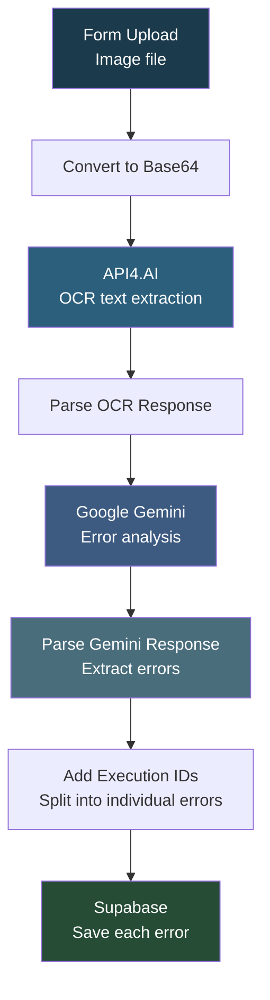

# API4 AI - OCR Error Detection

## Overview

This automation **extracts text from uploaded images using OCR and then checks it for spelling, grammar, punctuation, and spacing errors using AI**. You upload a packaging or product image through a form, the system reads all the text using API4.AI's OCR engine, sends it to Google Gemini for error analysis, and stores every detected error in a Supabase database with details like error type, severity, and suggested corrections.

## How It Works

```
Form Upload -> Convert to Base64 -> API4.AI OCR -> Parse Response -> Gemini Error Analysis -> Parse Errors -> Assign IDs -> Save to Supabase
```

### Workflow Diagram



### Workflow Steps

1. **Form Trigger** - User uploads an image file through a web form.
2. **Convert to Base64** - Converts the binary image to base64 encoding for API consumption.
3. **API4.AI OCR** - Sends the image to API4.AI's OCR endpoint to extract all visible text.
4. **Parse OCR Response** - Extracts the raw text from the API4.AI response structure.
5. **Google Gemini Analysis** - Sends the extracted text to Gemini 2.5 Flash with a detailed prompt to detect spelling, grammar, punctuation, spacing, and consistency errors. Returns structured JSON.
6. **Parse Gemini Response** - Cleans markdown fences, parses the JSON, and extracts the errors array and summary.
7. **Add Execution ID to Errors** - Assigns a unique execution ID and individual error IDs to each detected error, along with severity-based confidence scores.
8. **Save to Supabase** - Stores each error as a row in the ocr_table with all metadata (error type, found text, correction, location, confidence, coordinates).

## Nodes

| Node | Type |
|------|------|
| On form submission | Form Trigger |
| Code in JavaScript3 | JavaScript (base64 conversion) |
| api4.ai | HTTP Request (OCR) |
| Parse Google Vision Response1 | JavaScript Code |
| Message a model | Google Gemini 2.5 Flash |
| Parse Gemini Response1 | JavaScript Code |
| Add Execution ID to Errors1 | JavaScript Code |
| Create a row1 | Supabase (insert) |

## Integrations

- **API4.AI** - OCR text extraction from images
- **Google Gemini (2.5 Flash)** - AI-powered error detection and analysis
- **Supabase** - Database storage for detected errors

## Setup

1. Import `API4_AI.json` into your n8n instance.
2. Update credentials for API4.AI, Google Gemini, and Supabase.
3. Ensure the `ocr_table` exists in your Supabase database with the required columns.
4. Activate the workflow and upload an image through the form.
